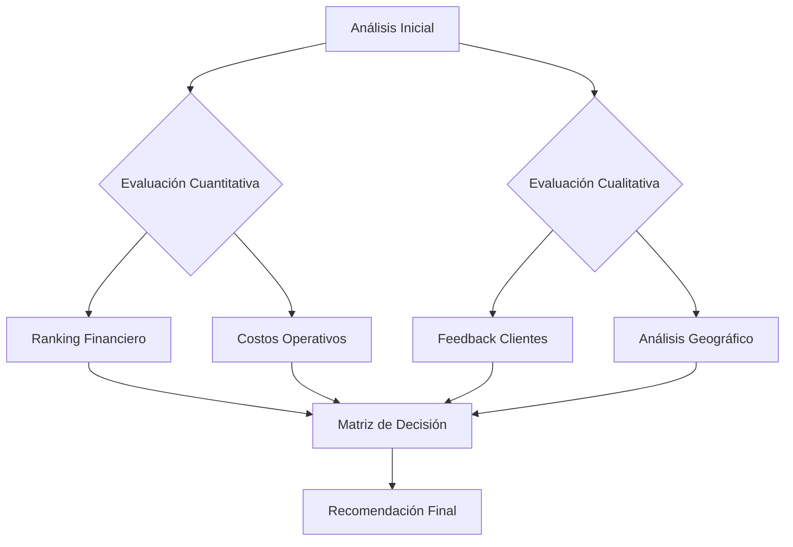
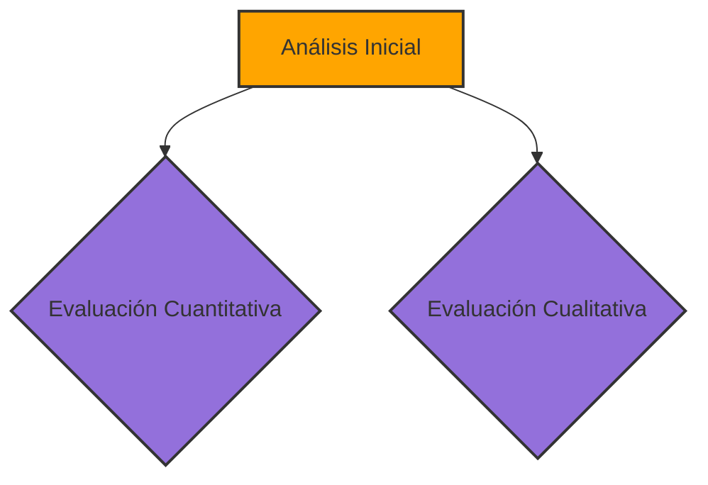
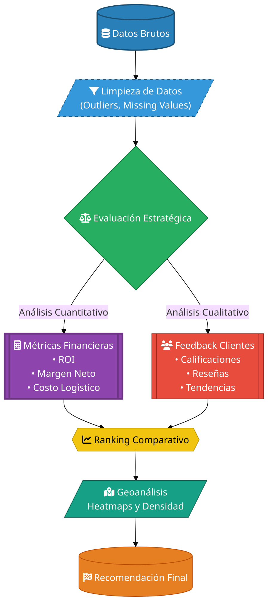

# Challenge 1 Data Science
Durante este desafío, ayudarás al Sr. Juan a decidir qué tienda de su cadena Alura Store debe vender para iniciar un nuevo emprendimiento. Para ello, analizarás datos de ventas, rendimiento y reseñas de las 4 tiendas de Alura Store. El objetivo es identificar la tienda menos eficiente y presentar una recomendación final basada en los datos.
 ## 🎯 **Propósito del Proyecto**

 **Ayudar al Sr. Juan a identificar cuál de sus 4 tiendas retail debería vender**, mediante análisis estratégico que evalúa:

1. 📈 **Rentabilidad** - Ingresos y márgenes de ganancia
2. 📊 **Desempeño Operativo** - Eficiencia logística y costos
3. ⭐ **Satisfacción Cliente** - Calificaciones promedio y reseñas
4. 🌍 **Potencial Geográfico** - Ubicación estratégica y densidad de ventas

---

### 🔍 **Criterios de Evaluación**
| Indicador               | Métrica Clave                          | 
|-------------------------|----------------------------------------|
| 🔴 Baja Rentabilidad    | <15% de contribución a ingresos totales |
| 🚫 Baja Rotación        | >40% de productos poco vendidos        |
| ⚠️ Insatisfacción       | Calificación promedio < 3.5/5          |
| 📍 Logística Costosa    | Costo de envío > promedio del sector    |
| 🌎 Ubicación Débil      | Baja densidad de ventas en mapa de calor|

---

## 📌 **Recomendación Final** 
**Tienda recomendada para venta: Tienda 4**  

✅ **Justificación técnica**:
bash
- 📉 14.9% de ingresos totales (más bajo)
- ⚠️ 3.1/5 en satisfacción cliente 
- 📦 $18.50 costo promedio de envío (+25% vs promedio)
- 🌎 Zona con alta competencia (ver heatmap)

**¿Como se Decidio?**

## 2. La estructura del proyecto y organizacion de los archivos.
## 3. Ejemplos de gráficos  e insights obtenidos.
## 4 Intrucciones  para  ejecutar el notebook.
#recomendacion_final
## conclusion

