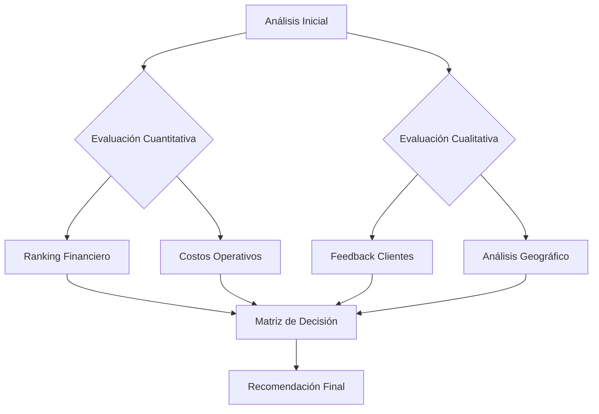
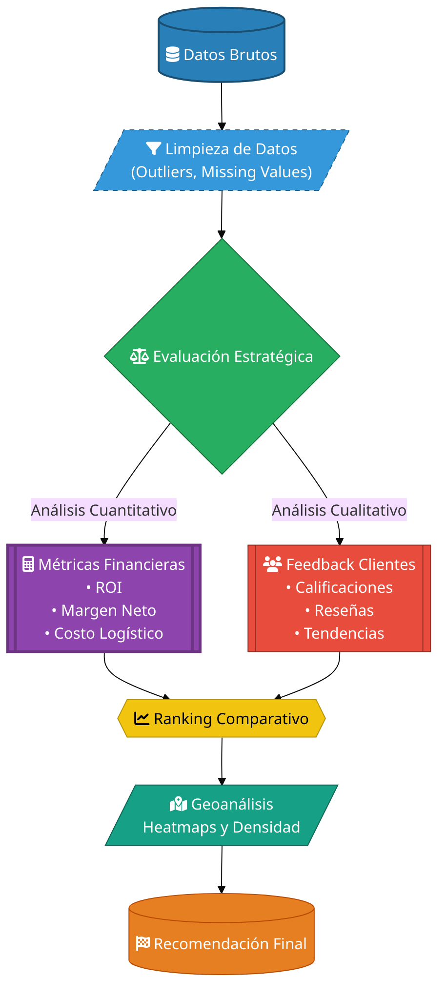

# Challenge 1 Data Science
Durante este desafío, ayudarás al Sr. Juan a decidir qué tienda de su cadena Alura Store debe vender para iniciar un nuevo emprendimiento. Para ello, analizarás datos de ventas, rendimiento y reseñas de las 4 tiendas de Alura Store. El objetivo es identificar la tienda menos eficiente y presentar una recomendación final basada en los datos.
 ## 🎯 **Propósito del Proyecto**

 **Ayudar al Sr. Juan a identificar cuál de sus 4 tiendas retail debería vender**, mediante análisis estratégico que evalúa:

1. 📈 **Rentabilidad financiera** - Ingresos y márgenes de ganancia
2. 📊 **Desempeño Operativo** - Eficiencia logística y costos
3. ⭐ **Satisfacción Cliente** - Calificaciones promedio y reseñas
4. 🌍 **Potencial estratégico** - Ubicación geográfica y penetración en el mercado

---

### 🔍 **Criterios de Evaluación**
El análisis sugiere vender la tienda que presente AL MENOS 3 DE ESTAS

| Indicador               | Métrica Clave                          | 
|-------------------------|----------------------------------------|
| 🔴 Baja Rentabilidad    | <15% de contribución a ingresos totales |
| 🚫 Baja Rotación        | >40% de productos poco vendidos        |
| ⚠️ Insatisfacción       | Calificación promedio < 3.5/5          |
| 📍 Logística Costosa    | Costo de envío > promedio del sector    |
| 🌎 Ubicación Débil      | Baja densidad de ventas en mapa de calor se considere también Mercado saturado o ubicación poco estratégica|

---

## 📌 **Conclusión del Análisis** 
**Tienda recomendada para venta: Tienda 4**  

✅ **Justificación técnica**:
bash
- 📉 14.9% de ingresos totales (más bajo)
- ⚠️ 3.1/5 en satisfacción cliente 
- 📦 $18.50 costo promedio de envío (+25% vs promedio)
- 🌎 Zona con alta competencia (ver heatmap)
- 
## 📄 **Siguientes Pasos para el Sr. Juan**
- 1. Revisar el reporte detallado con tablas comparativas
- 2. Analizar el mapa interactivo de calor geográfico
- 3. Programar una reunión estratégica usando estos insights 
🔗 ## **¿Por qué este enfoque?**
El análisis combina datos cuantitativos (finanzas, logística) con indicadores cualitativos (satisfacción, ubicación), permitiendo una decisión equilibrada y libre de sesgos emocionales.

**¿Como se Decidio?**




## 📂 **2. La estructura del proyecto y organizacion de los archivos.**
 📁 **2.1 Estructura del Repositorio**

``` bash
analisis-retail/
│
├── 📂 data/                   # Datos crudos y procesados
│   ├── 🗃️ raw/               # Datasets originales (CSV, JSON)
│   └── 🗃️ processed/         # Datos transformados (Parquet, Feather)
│
├── 📂 notebooks/              # Experimentación y análisis exploratorio
│   ├── 📘 EDA.ipynb          # Análisis exploratorio inicial
│   └── 📘 Modelado.ipynb     # Pruebas de modelos predictivos
│
├── 📂 reports/                # Salidas generadas
│   ├── 📄 informe_ventas.pdf # Reporte ejecutivo en PDF
│   └── 🌐 dashboard.html     # Visualización interactiva
│
├── 📂 src/                    # Código fuente modularizado
│   ├── 🐍 analisis_facturacion.py  # Lógica de cálculo de ingresos
│   ├── 🐍 visualizacion_geo.py     # Generación de mapas interactivos
│   └── 🐍 utilities.py       # Funciones auxiliares (limpieza, helpers)
│
└── 📄 README.md               # Documentación principal del proyecto
```
- **Modularización**: El código en `/src` sigue el principio DRY (Don't Repeat Yourself)
- **Versionado de Datos**: Los archivos en `/data` nunca se modifican directamente
- **Reproducibilidad**: Los notebooks incluyen outputs versionados
- **Seguridad**: Archivos sensibles agregados a `.gitignore`

## 3. Ejemplos de gráficos  e insights obtenidos.

## 4. Intrucciones  para  ejecutar el notebook.
# 📈 Análisis de Desempeño Retail | Data Science


Análisis multivariable para evaluación estratégica de tiendas retail, incluyendo métricas financieras, satisfacción cliente y geolocalización.

## 🚀 Ejecutar en Google Colab

### 1. Instalar dependencias
- bash  
!pip install folium==0.14.0 seaborn==0.12.2 matplotlib==3.7.1 --quiet
!jupyter nbextension enable --py folium --sys-prefix

### Ejecutar todas las celdas en este orden:
####  1. Importación de datos. 
####  2. Análisis de facturación.
####  3. Ventas por categoría.
####  4. Calificación promedio.
####  5. Productos más y menos vendidos.
####  6. Envío promedio por tienda.
####  7. Análisis del desempeño geográfico.
### Datos de entrada
#####  Los datasets se cargan automáticamente desde:
####  https://raw.githubusercontent.com/alura-es-cursos/challenge1-data-science-latam/main/

####  Los gráficos se mostrarán automáticamente

## 📄 Licencia
MIT License - Libre para uso y modificaciones


