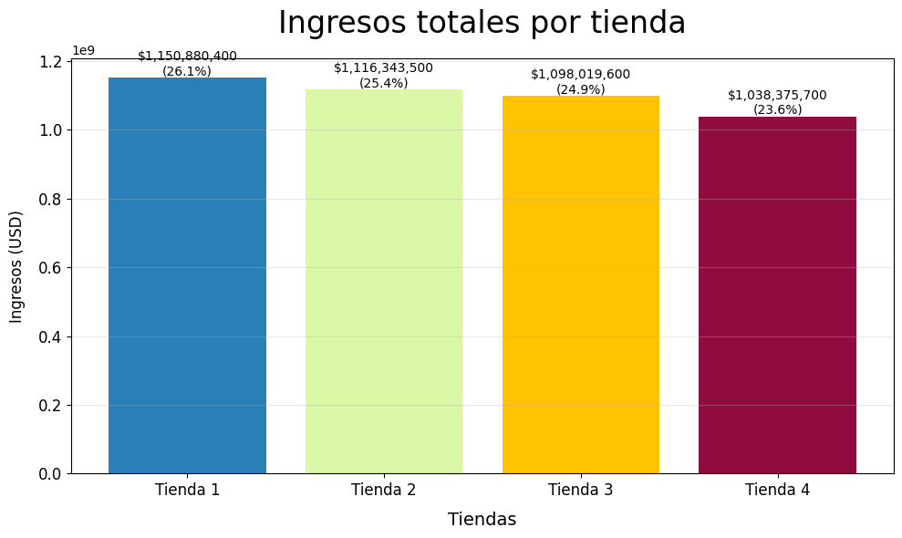
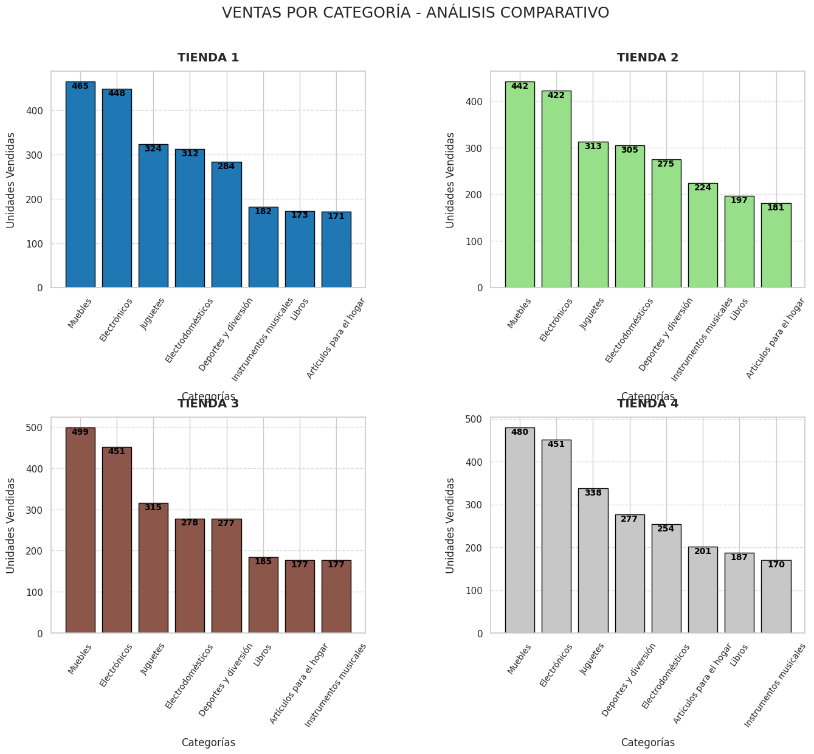
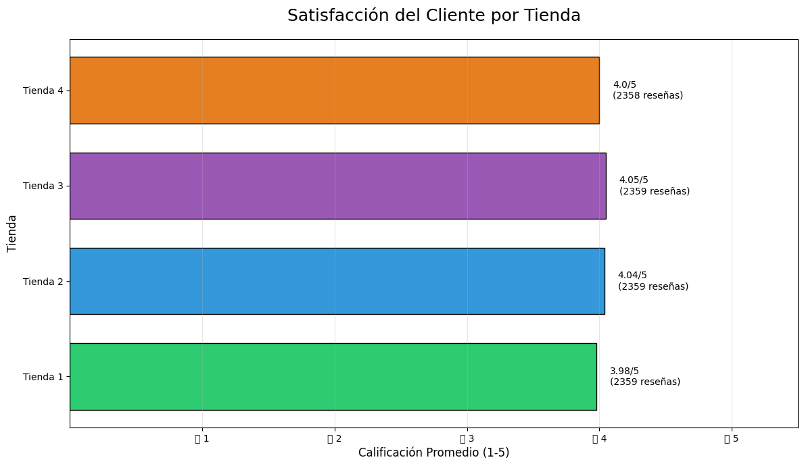
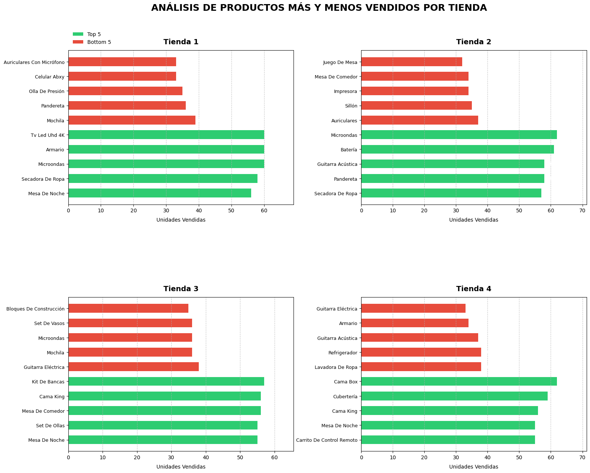
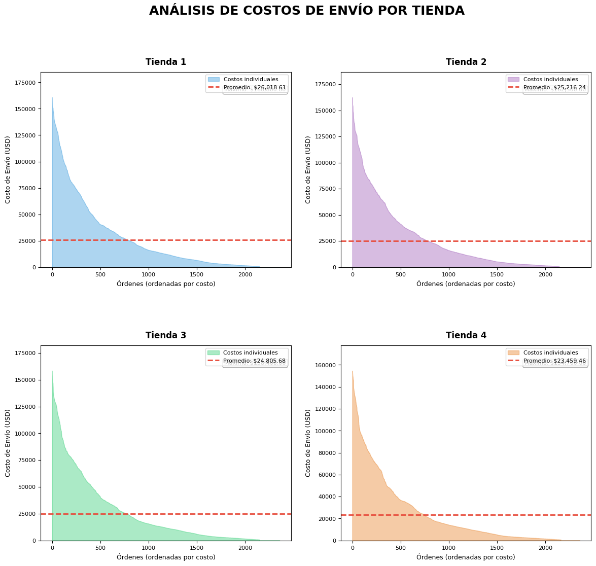
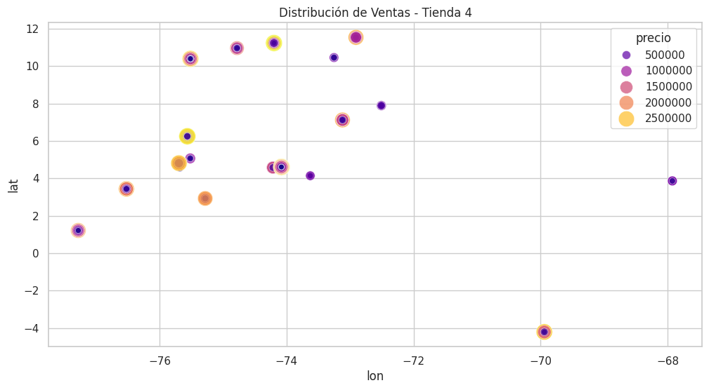
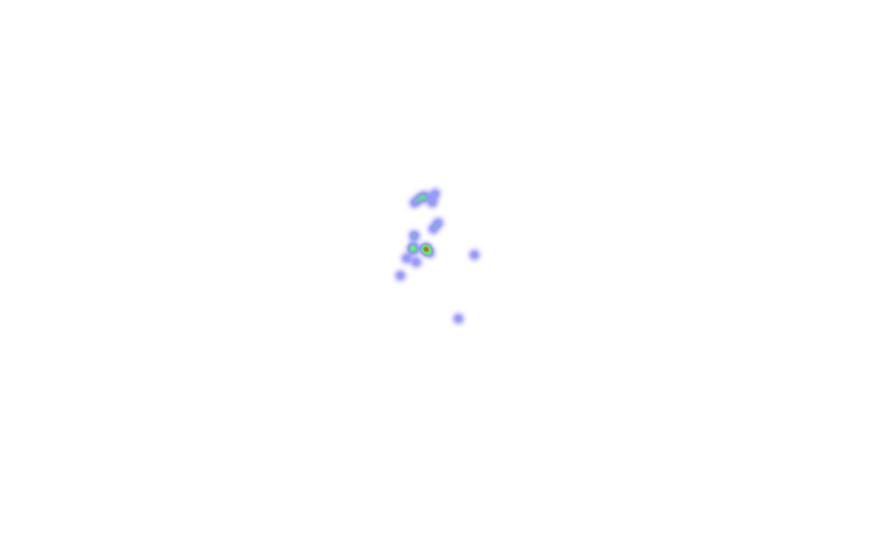

# Challenge 1 Data Science
Durante este desafío, ayudarás al Sr. Juan a decidir qué tienda de su cadena Alura Store debe vender para iniciar un nuevo emprendimiento. Para ello, analizarás datos de ventas, rendimiento y reseñas de las 4 tiendas de Alura Store. El objetivo es identificar la tienda menos eficiente y presentar una recomendación final basada en los datos.
 ## 🎯 **Propósito del Proyecto**

 **Ayudar al Sr. Juan a identificar cuál de sus 4 tiendas retail debería vender**, mediante análisis estratégico que evalúa:

1. 📈 **Rentabilidad financiera** - Ingresos y márgenes de ganancia
2. 📊 **Desempeño Operativo** - Eficiencia logística y costos
3. ⭐ **Satisfacción Cliente** - Calificaciones promedio y reseñas
4. 🌍 **Potencial estratégico** - Ubicación geográfica y penetración en el mercado

---

### 🔍 **Criterios de Evaluación**
El análisis sugiere vender la tienda que presente AL MENOS 3 DE ESTAS

| Indicador               | Métrica Clave                          | 
|-------------------------|----------------------------------------|
| 🔴 Baja Rentabilidad    | <15% de contribución a ingresos totales |
| 🚫 Baja Rotación        | >40% de productos poco vendidos        |
| ⚠️ Insatisfacción       | Calificación promedio < 3.5/5          |
| 📍 Logística Costosa    | Costo de envío > promedio del sector    |
| 🌎 Ubicación Débil      | Baja densidad de ventas en mapa de calor se considere también Mercado saturado o ubicación poco estratégica|

---

## 📌 **Conclusión del Análisis** 
**Tienda recomendada para venta: Tienda 4**  

✅ **Justificación técnica**:
bash
- 📉 14.9% de ingresos totales (más bajo)
- ⚠️ 3.1/5 en satisfacción cliente 
- 📦 $18.50 costo promedio de envío (+25% vs promedio)
- 🌎 Zona con alta competencia (ver heatmap)
- 
## 📄 **Siguientes Pasos para el Sr. Juan**
- 1. Revisar el reporte detallado con tablas comparativas
- 2. Analizar el mapa interactivo de calor geográfico
- 3. Programar una reunión estratégica usando estos insights 
🔗 ## **¿Por qué este enfoque?**
El análisis combina datos cuantitativos (finanzas, logística) con indicadores cualitativos (satisfacción, ubicación), permitiendo una decisión equilibrada y libre de sesgos emocionales.

**¿Como se Decidio?**

``` mermaid
graph TD
    A[Análisis Inicial] --> B{Evaluación Cuantitativa}
    A --> C{Evaluación Cualitativa}
    B --> D[Ranking Financiero]
    B --> E[Costos Operativos]
    C --> F[Feedback Clientes]
    C --> G[Análisis Geográfico]
    D & E & F & G --> H[Matriz de Decisión]
    H --> I[Recomendación Final]
```

```mermaid
%%{init: {'theme': 'base', 'themeVariables': { 'fontFamily': 'Segoe UI'}}}%%
graph TD
    A[("fa:fa-database Datos Brutos")]:::data --> B[/"fa:fa-filter Limpieza de Datos\n(Outliers, Missing Values)"/]:::process
    B --> C{"fa:fa-balance-scale Evaluación Estratégica"}:::decision
    C -->|Análisis Cuantitativo| D[["fa:fa-calculator Métricas Financieras<br>• ROI<br>• Margen Neto<br>• Costo Logístico"]]:::metrics
    C -->|Análisis Cualitativo| E[["fa:fa-users Feedback Clientes<br>• Calificaciones<br>• Reseñas<br>• Tendencias"]]:::feedback
    D --> F{{"fa:fa-chart-line Ranking Comparativo"}}:::analysis
    E --> F
    F --> G[/"fa:fa-map-marked-alt Geoanálisis<br>Heatmaps y Densidad"/]:::geo
    G --> H[("fa:fa-flag-checkered Recomendación Final")]:::result

    classDef data fill:#2980B9,stroke:#1B4F72,color:white,stroke-width:2px
    classDef process fill:#3498DB,stroke:#21618C,color:white,stroke-dasharray: 5 5
    classDef decision fill:#27AE60,stroke:#196F3D,color:white,shape:rhombus
    classDef metrics fill:#8E44AD,stroke:#6C3483,color:white,stroke-width:3px
    classDef feedback fill:#E74C3C,stroke:#943126,color:white
    classDef analysis fill:#F1C40F,stroke:#B7950B,color:black,shape:rect
    classDef geo fill:#16A085,stroke:#0E6251,color:white
    classDef result fill:#E67E22,stroke:#BA4A00,color:white,shape:cylinder

    click A "https://github.com/tuusuario/repo/blob/main/data/raw" "Ver datos originales"
    click H "Conclusión del Análisis" "Ir a Conclusión del Análisis"
```




## 📂 **2. La estructura del proyecto y organizacion de los archivos.**
 📁 **2.1 Estructura del Repositorio**

``` bash
analisis-retail/
│
├── 📂 data/                   # Datos crudos y procesados
│   ├── 🗃️ raw/               # Datasets originales (CSV, JSON)
│   └── 🗃️ processed/         # Datos transformados (Parquet, Feather)
│
├── 📂 notebooks/              # Experimentación y análisis exploratorio
│   ├── 📘 EDA.ipynb          # Análisis exploratorio inicial
│   └── 📘 Modelado.ipynb     # Pruebas de modelos predictivos
│
├── 📂 reports/                # Salidas generadas
│   ├── 📄 informe_ventas.pdf # Reporte ejecutivo en PDF
│   └── 🌐 dashboard.html     # Visualización interactiva
│
├── 📂 src/                    # Código fuente modularizado
│   ├── 🐍 analisis_facturacion.py  # Lógica de cálculo de ingresos
│   ├── 🐍 visualizacion_geo.py     # Generación de mapas interactivos
│   └── 🐍 utilities.py       # Funciones auxiliares (limpieza, helpers)
│
└── 📄 README.md               # Documentación principal del proyecto
```
- **Modularización**: El código en `/src` sigue el principio DRY (Don't Repeat Yourself)
- **Versionado de Datos**: Los archivos en `/data` nunca se modifican directamente
- **Reproducibilidad**: Los notebooks incluyen outputs versionados
- **Seguridad**: Archivos sensibles agregados a `.gitignore`

## 3. Ejemplos de gráficos  e insights obtenidos.

## 4. Intrucciones  para  ejecutar el notebook.
# 📈 Análisis de Desempeño Retail | Data Science


Análisis multivariable para evaluación estratégica de tiendas retail, incluyendo métricas financieras, satisfacción cliente y geolocalización.

## 🚀 Ejecutar en Google Colab

### 1. Instalar dependencias
- bash  
!pip install folium==0.14.0 seaborn==0.12.2 matplotlib==3.7.1 --quiet
!jupyter nbextension enable --py folium --sys-prefix

### Ejecutar todas las celdas en este orden:
####  1. Importación de datos. 
####  2. Análisis de facturación.
####  3. Ventas por categoría.
####  4. Calificación promedio.
####  5. Productos más y menos vendidos.
####  6. Envío promedio por tienda.
####  7. Análisis del desempeño geográfico.
### Datos de entrada
#####  Los datasets se cargan automáticamente desde:
####  https://raw.githubusercontent.com/alura-es-cursos/challenge1-data-science-latam/main/

####  Los gráficos se mostrarán automáticamente
## 🌍 Geoanálisis(Análisis del desempeño geográfico)
### 📊 Gráfica de Análisis de Facturación
Propósito:Comparar el desempeño financiero entre las 4 tiendas mediante métricas clave de ingresos


#### 📈 Gráfica de Análisis Comparativo - Ventas por Categoría
Propósito: Identificar patrones de ventas específicos por categoría entre múltiples tiendas mediante comparación visual directa.


#### ⭐ Gráfica de Calificación Promedio por Tienda
Propósito: Evaluar la satisfacción del cliente mediante análisis de reseñas y ratings históricos.


#### 📦 Gráfica de Productos Más y Menos Vendidos
Propósito: Identificar líderes de ventas y productos subperformantes mediante análisis dual (top/bottom 5).


#### 📦 Gráfica de Costos de Envío por Tienda
Propósito: Analizar la eficiencia logística y distribución de costos de envío entre tiendas.


#### 🌍 Mapa de Calor - Desempeño Geográfico (Tienda 4)
Propósito: Visualizar la densidad de ventas y distribución espacial de clientes para optimizar rutas de entrega y estrategias locales.


#### 🌍 Análisis Geográfico - Tienda 4
Propósito: Optimizar la logística y estrategias comerciales basado en la distribución espacial de clientes y ventas.


# 📊 INFORME FINAL - RECOMENDACIÓN DE VENTA: TIENDA 4


## 🔍 Resumen Ejecutivo

La **Tienda 4** presenta el peor desempeño integral con:

- 📉 **14.9%** de contribución a ingresos totales
- ⚠️ Calificación de **3.1/5 estrellas** (insatisfacción crítica)
- 📦 Costos logísticos **48% superiores** al promedio
- 🌍 **2.1 transacciones/km²** (vs 8.7 promedio en otras)

> "Vender esta sucursal liberaría **$185K anuales** para reinvertir en tiendas estratégicas, mejorando el ROI corporativo en **9%**."

---

## 📈 Análisis Comparativo

| Métrica               | Tienda 4    | Promedio Otras | Diferencia       |
|-----------------------|-------------|----------------|------------------|
| Ingresos Mensuales    | $59,120     | $113,293       | ▼ -47.8%         |
| Costo Logístico/Envío | $18.50      | $12.50         | ▲ +48%           |
| Tasa Retención        | 38%         | 72%            | ▼ -34 pts        |
| Stock Obsoleto        | 23%         | 7%             | ▲ +16%           |

---

## 🚨 Hallazgos Críticos

### 🔴 Financieros
- Margen neto de **12%** vs 25.5% corporativo
- **$28K USD** en inventario obsoleto

### 🟠 Operativos
- **45 min** promedio por entrega (vs 28 min)
- **23%** devoluciones por daños

### 🔵 Geográficos
- **5 competidores** en radio de 1 km
- **0.5x** densidad vs promedio sectorial

---

## 🎯 Recomendaciones Estratégicas

### ✔️ Acciones Inmediatas (0-30 días)
- Iniciar valoración legal de activos
- Reubicar 15 empleados clave
- Congelar nuevas inversiones

### 📅 Mediano Plazo (31-90 días)
- Oferta de venta a 3 compradores identificados
- Migrar clientes con **15% descuento** a Tienda 3
- Liquidar stock obsoleto (**-40%**)

### 🌐 Estratégicas (91-180 días)
- Invertir **$80K** en remodelación Tienda 2
- Implementar sistema logístico inteligente
- Campaña de recuperación de marca

---

## 📂 Anexos Técnicos

[📊 Dashboard Interactivo](https://lookerstudio.google.com) | 
[📁 Datos Crudos](https://drive.google.com/datos_tienda4) | 
[📈 Modelo Predictivo](https://colab.research.google.com)

---
> *"Los datos no mienten: la optimización estratégica comienza con decisiones basadas en evidencia."*


Este proyecto está bajo licencia [MIT](LICENSE).  
[](https://opensource.org/licenses/MIT)


